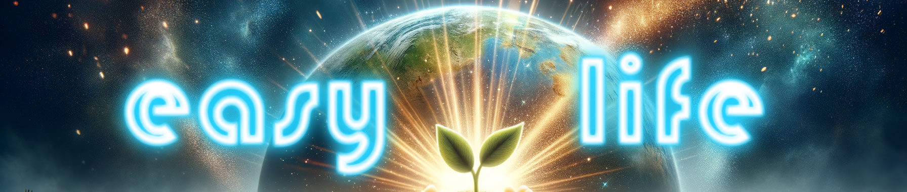

## Hi there! 👋 I'm Stephen Gusse, a passionate Software Engineer.

🚀 With over a decade of experience, I've honed my skills in crafting top-notch proprietary enterprise software products. My journey is all about utilizing diverse technologies to design, develop, and deploy enterprise-class solutions while gaining deep insights into customers' needs and product usage.

👨‍🏭 Leading and mentoring teams, I establish coding standards and UI best practices. My extensive app development background ensures I'm always at the forefront of innovative UI engineering.

🛠️ My tech toolkit includes NextJS, React, React Native, NodeJS, Redux/RTK Toolkit, and Angular. I thrive in Agile environments, where I've spent more than 10 years crafting accessible UIs for web applications, emphasizing iterations, continuous integration, and unwavering quality.

🔐 Industry Authentication standards like oAuth2? Yep, I've got you covered. Incorporating Authorization aspects into the UI framework is just another day at the office for me.

🧠 When it comes to problem-solving, my Agile mindset shines through, adapting seamlessly to various methodologies. My knack for breaking down complex technical matters into clear, digestible explanations lets me bridge the gap between tech and business effortlessly.

Let's connect and build the future together! 🌟

### Languages/Frameworks I'm good at:

<a href="https://nginx.org">
  <
</a>

### Environments I work with:

### Visit my

**[Portfolio](https://easy-life93.github.io) - [Linkedin]()**

---

- 🔭 I’m currently working as **Sr. Software Engineer @ Tech9**
- 🌱 I’m currently learning **Blockchain**
- 👯 I’m looking to collaborate on open source/commercial projects
- 💬 Ask me about **Web Development**

